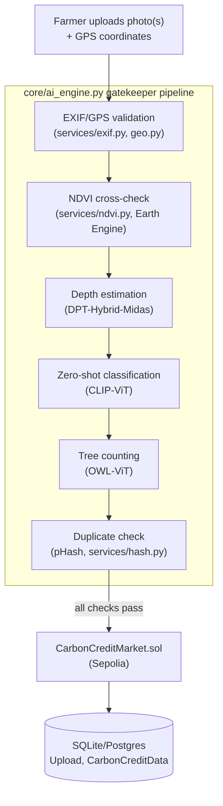
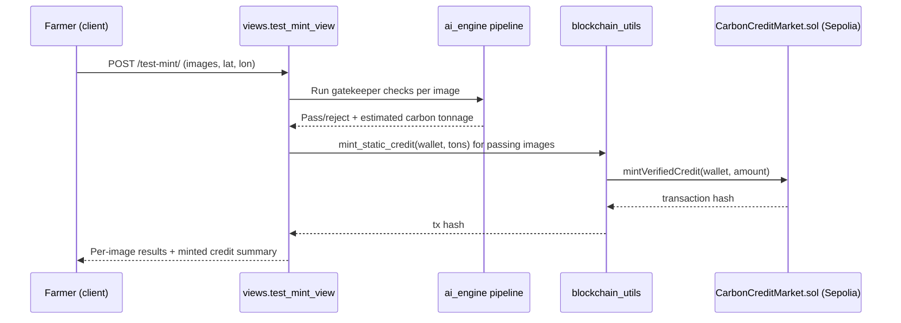

# CarbonVerse (CARBONCRED)

An AI-verified carbon credit platform: farmers upload geo-tagged photos of biomass, an AI pipeline verifies the claim, and a smart contract mints a carbon credit on-chain.


## Table of Contents

- [Overview](#overview)
- [Problem Statement](#problem-statement)
- [Solution](#solution)
- [Current Scope](#current-scope)
- [Features](#features)
- [Architecture](#architecture)
- [Tech Stack](#tech-stack)
- [Project Structure](#project-structure)
- [System Workflow](#system-workflow)
- [Installation](#installation)
- [Configuration](#configuration)
- [Running Locally](#running-locally)
- [API Documentation](#api-documentation)
- [Author](#author)

## Overview

CarbonVerse lets a landowner photograph their trees or crops and turns that photo into a verified, on-chain carbon credit. A multi-stage AI pipeline checks the photo is genuine (not a screen photo, not a duplicate, actually shows biomass, at the claimed GPS location) before a Solidity contract on Sepolia mints the credit to the farmer's wallet.

## Problem Statement

Carbon credit issuance is normally a slow, manual verification process, and it's vulnerable to fraud: reused photos, staged images, or claims made from the wrong location. A farmer needs a fast, low-friction way to submit evidence, and the issuer needs confidence that evidence is real without a human reviewing every submission by hand.

## Solution

Every uploaded photo runs through a chain of AI "gatekeeper" checks before any credit is minted: EXIF/GPS validation, an NDVI cross-check against satellite data, a monocular depth-estimation check to reject flat screen photos, zero-shot species/biomass classification, and a perceptual-hash duplicate check against previously approved uploads. Only images that pass every gate reach `mint_static_credit()`, which calls a deployed `CarbonCreditMarket.sol` contract on the Sepolia testnet via web3.py.

## Current Scope

The three-role vision below (Seller / Buyer / Admin) is the target design. What's actually implemented today is the Seller/Offset-Generator flow: a farmer uploads a photo, it runs through the gatekeeper pipeline, and a credit is minted (`core/views.py` -> `test_mint_view`, the only API endpoint in `core/urls.py`). There is no Buyer marketplace and no Admin oversight dashboard in the codebase yet.

- **Offset Generator (Seller), implemented:** farmers/landowners capture geo-tagged biomass photos and submit them for AI-verified credit minting.
- **Corporate Compliance (Buyer), planned, not yet built:** would let businesses purchase verified credits from a marketplace.
- **Network Overseer (Admin), planned, not yet built:** would give system operators visibility into network-wide credit volume and fraud activity.

## Features

| Gatekeeper Check | How it works |
|---|---|
| Location Check | Extracts GPS from EXIF (`core/services/exif.py`) and validates it against the claimed coordinates within a distance tolerance (`core/services/geo.py`, haversine distance), cross-referenced against Sentinel/Google Earth Engine NDVI data (`core/services/ndvi.py`) |
| Screen/Deepfake Prevention | Runs Intel's DPT-Hybrid-Midas depth model to check for real depth variance in the scene, rejecting flat images (e.g. a photo of a screen) |
| Biomass Classification | Zero-shot classification with OpenAI CLIP to confirm the image contains valid biomass and identify species (Neem, Teak, Mango, etc.) |
| Tree Counting & Volume | OWL-ViT draws bounding boxes around trees/foliage; combined with HSV green-pixel density analysis to estimate carbon tonnage per species (`core/ai_engine.py`) |
| Duplicate Detection | Computes a perceptual hash (`imagehash.phash`) and checks it against previously approved uploads before minting; a separate exact-MD5 check also runs across a single batch upload |
| On-Chain Minting | Calls `mintVerifiedCredit()` on a deployed `CarbonCreditMarket.sol` contract on Sepolia via web3.py |

## Architecture



## Tech Stack

| Layer | Technology |
|---|---|
| Backend framework | Django, Django REST Framework, django-cors-headers |
| Computer vision / AI | PyTorch, Hugging Face `transformers` (CLIP, OWL-ViT, DPT-Hybrid-Midas), `timm`, Ultralytics, TensorFlow/tf-keras, OpenCV, Pillow, ImageHash |
| Satellite / geospatial | Google Earth Engine API, Sentinel Hub |
| Blockchain | Solidity (`CarbonCreditMarket.sol`), Ethereum Sepolia testnet, Web3.py |
| Database | Django ORM (SQLite by default) |

## Project Structure

```
CARBONCRED/
├── core/
│   ├── views.py               # test_mint_view: batch upload + mint endpoint
│   ├── ai_engine.py            # Gatekeeper pipeline (depth, CLIP, OWL-ViT, NDVI, hash)
│   ├── blockchain_utils.py     # web3.py contract calls (mint_static_credit, get_rcc_balance)
│   ├── models.py               # CarbonCreditData, Upload
│   ├── urls.py                 # landing, app, and /test-mint/ routes
│   └── services/
│       ├── exif.py             # EXIF GPS/timestamp extraction
│       ├── geo.py              # Haversine distance, location/timestamp validation
│       ├── ndvi.py             # Sentinel/GEE NDVI fetch + correlation
│       ├── vision.py           # detect_tree, analyze_green_content
│       └── hash.py             # Perceptual-hash duplicate check (DB-backed)
├── contracts/
│   └── CarbonCreditMarket.sol  # Solidity contract minting credits to farmer wallets
├── backend/                     # Legacy/unused Django app, not in INSTALLED_APPS
└── manage.py
```

`backend/` is a leftover app directory that isn't registered in `INSTALLED_APPS` or referenced anywhere; the active app is `core/`. `core/hash.py` (distinct from `core/services/hash.py`) is similarly dead code, unused by the pipeline.

## System Workflow



## Installation

```bash
git clone https://github.com/KAVYAJOSHI1/CARBONCRED.git
cd CARBONCRED
pip install -r requirements.txt
```

## Configuration

Copy `.env.example` to `.env` and set:

| Variable | Purpose |
|---|---|
| `INFURA_URL` | RPC endpoint for the Sepolia testnet |
| `PRIVATE_KEY` | Wallet key used to sign minting transactions |
| `CONTRACT_ADDRESS` | Deployed address of `CarbonCreditMarket.sol` |

Google Earth Engine credentials are required if you want live NDVI verification rather than a stubbed response.

## Running Locally

```bash
python manage.py makemigrations
python manage.py migrate
python manage.py runserver
```

Visit `http://127.0.0.1:8000/` for the landing page or `http://127.0.0.1:8000/app/` for the upload dashboard.

To test camera/GPS capture from a phone, tunnel the local server with `ngrok http 8000` and open the forwarding URL on the device.

## API Documentation

Defined in `core/urls.py`.

| Method | Endpoint | Description |
|---|---|---|
| POST | `/test-mint/` | Upload one or more biomass images with `latitude`/`longitude`; runs the gatekeeper pipeline and mints a credit per passing image |
| GET | `/` | Landing page |
| GET | `/app/` | Upload dashboard |

## Author

Built by Kavya Joshi.
